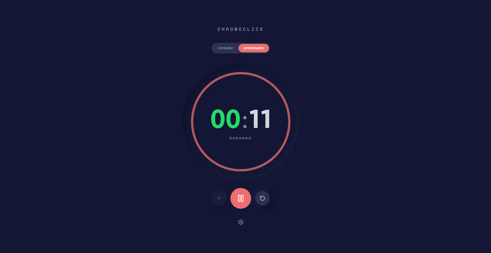

# ⏱️ ChronoClick

Aplicação desenvolvida em Vite + React + TypeScript como parte de um desafio técnico para vaga de Frontend Júnior.

O projeto consiste em um contador interativo que pode ser convertido em cronômetro, com foco boas práticas e organização de código.

### 🛠️ Detalhes Técnicos

- <b>Lógica Visual:</b> Os números do contador ficam verdes nos algarismos pares.
- <b>Modo Cronômetro:</b> Faça o contador se tornar um cronômetro através de mais um botão.
- <b>Precisão:</b> O cronômetro não precisa contar milissegundos.
- <b>Controle Inteligente:</b> Não há necessidade de mais um botão para a parada do cronômetro, pode ser o mesmo botão de início do cronômetro.

## 🖼️ Preview do Projeto

<p align="center">
  
</p>

## 📌 Visão Geral

ChronoClick é uma aplicação simples em conceito, mas estruturada com foco em:

- <b>Separação de responsabilidades:</b> UI separada da lógica de estado.
- <b>Componentização:</b> Divisão atômica de elementos da interface.
- <b>Isolamento da lógica de negócio:</b> Uso de Hooks customizados para gerenciamento de tempo.
- <b>Tipagem forte:</b> Uso integral de TypeScript para evitar erros em tempo de execução.

## 🚀 Tecnologias Utilizadas

- React
- TypeScript
- Vite
- CSS Modules/Standard (Estilização isolada por componente)

## 🌟 Funcionalidades

- ✔️ Contador incremental por clique
- ✔️ Destaque visual para algarismos pares (verde)
- ✔️ Modo cronômetro (contagem automática em segundos)
- ✔️ Botão único para iniciar/parar o cronômetro
- ✔️ Painel de configurações/ajustes.
- ✔️ Estrutura escalável baseada em separação de responsabilidades


## 🏗️ Arquitetura do Projeto

A estrutura de pastas reflete uma organização profissional, separando componentes de interface, lógica global e definições de tipo.

### 📁 Estrutura de Pastas:

```bash
src/
 ├── app/           → Ponto de entrada da aplicação (App.tsx)
 ├── assets/        → Recursos estáticos (imagens, ícones)
 ├── components/    → Componentes modulares (Counter, Settings)
 ├── hooks/         → Hooks customizados (Lógica de estado e timers)
 ├── pages/         → Estruturas de página (ex: NotFound)
 ├── root/          → Componente de roteamento ou provedor base
 ├── styles/        → Definições de tema e CSS global
 ├── types/         → Definições de tipos TypeScript (.d.ts)
 └── main.tsx       → Renderização inicial do React

```
### 🗄️ Detalhamento dos Arquivos (Baseado no Source):

```bash
src/
 ├── components/
 │    ├── Counter/
 │    │    ├── Counter.tsx          # Componente principal do contador
 │    │    ├── CounterControls.tsx  # Botões de ação e estilos
 │    │    └── CounterDisplay.tsx   # Display visual do número
 │    └── Settings/
 │         └── SettingsPanel.tsx    # Painel de configuração da aplicação
 ├── hooks/
 │    └── useCounter.tsx           # Lógica encapsulada do cronômetro/contador
 ├── types/
 │    └── counter.types.ts         # Contratos de dados e interfaces
 └── styles/
      ├── global.css               # Reset e estilos base
      └── theme.ts                 # Variáveis de cores e tokens
 ```

<b>Nota:</b> A lógica foi isolada no hook useCounter.tsx, garantindo que os componentes de UI (CounterDisplay, etc.) se preocupem apenas com a renderização, facilitando testes unitários e reutilização de código.


## ▶️ Como Executar o Projeto

```bash
# 1. Clonar o repositório
git clone https://github.com/giovanasanchs/chronoclick.git

# 2. Entrar na pasta
cd chronoclick

# 3. Instalar as dependências
npm install

# 4. Iniciar o servidor de desenvolvimento
npm run dev

```
